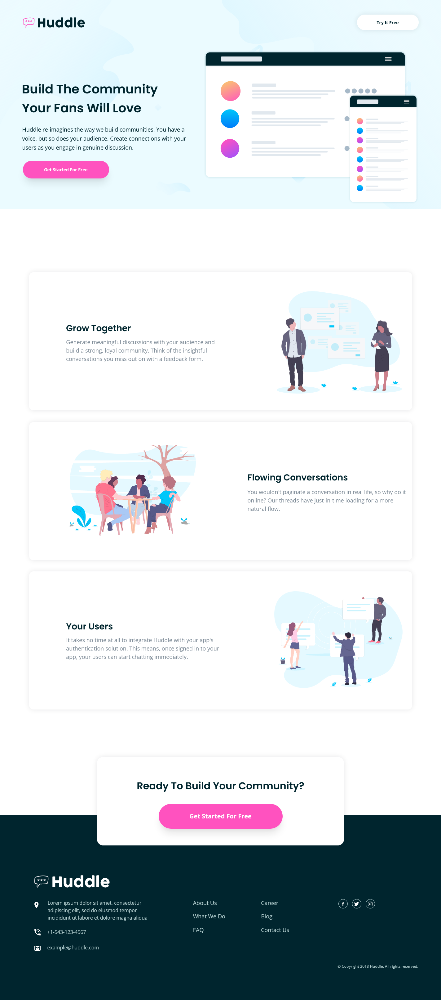

# Frontend Mentor - Huddle landing page with alternating feature blocks solution

This is a solution to the [Huddle landing page with alternating feature blocks challenge on Frontend Mentor](https://www.frontendmentor.io/challenges/huddle-landing-page-with-alternating-feature-blocks-5ca5f5981e82137ec91a5100).

## Table of contents

- [Overview](#overview)
  - [The challenge](#the-challenge)
  - [Screenshot](#screenshot)
  - [Links](#links)
- [My process](#my-process)
  - [Built with](#built-with)
- [Author](#author)

## Overview

### Screenshot

### Links

- Solution URL: [Repo](https://github.com/karinaestaba/huddle-community-landing-page.git)
- Live Site URL: [Demo](https://karinaestaba.github.io/huddle-community-landing-page)

## My process

### Built with

- Semantic HTML5 markup
- CSS custom properties
- Flexbox, CSS GRID
- Sass
- Vanilla javascript.
- Intersection observer

## Author

- Website - [Karina Estaba]
- Frontend Mentor - [karinaestaba](https://www.frontendmentor.io/profile/karinaestaba)
